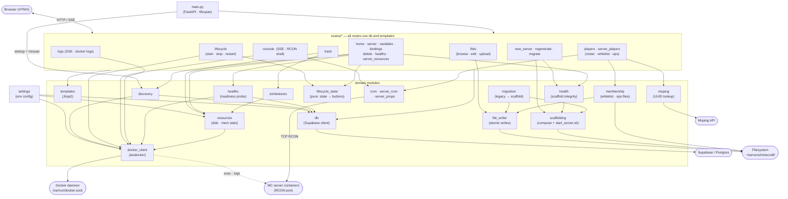

# Architecture

## Module graph

```mermaid
flowchart TD
    %% ── External systems ──────────────────────────────────────────────
    Browser(["Browser (HTMX)"])
    DockerD(["Docker daemon\n/var/run/docker.sock"])
    Supabase(["Supabase / Postgres"])
    Mojang(["Mojang API"])
    FS(["Filesystem\n~/servers/minecraft/"])
    MCNet(["MC server containers\n(RCON port)"])

    %% ── App entry ─────────────────────────────────────────────────────
    main["main.py\n(FastAPI · lifespan)"]
    settings["settings\n(env config)"]

    %% ── Routes ────────────────────────────────────────────────────────
    subgraph routes["routes/*  —  all routes use  db  and  templates"]
        r_lifecycle["lifecycle\n(start · stop · restart)"]
        r_console["console  (SSE · RCON shell)"]
        r_logs["logs  (SSE · docker logs)"]
        r_files["files\n(browse · edit · upload)"]
        r_players["players · server_players\n(roster · whitelist · ops)"]
        r_scaffold["new_server · regenerate · migrate"]
        r_trash["trash"]
        r_core["home · server · variables · bindings\ndelete · healthz · server_resources"]
    end

    %% ── Domain modules ────────────────────────────────────────────────
    subgraph domain["domain modules"]
        db["db\n(Supabase client)"]
        docker_client["docker_client\n(aiodocker)"]
        templates["templates\n(Jinja2)"]
        discovery["discovery"]
        healthz_m["healthz\n(readiness probe)"]
        health_m["health\n(scaffold integrity)"]
        rcon_m["rcon · server_rcon\n· server_props"]
        membership["membership\n(whitelist · ops files)"]
        mojang_m["mojang\n(UUID lookup)"]
        resources["resources\n(disk · mem stats)"]
        tombstones["tombstones"]
        scaffolding["scaffolding\n(compose + start_server.sh)"]
        migration["migration\n(legacy → scaffold)"]
        file_writer["file_writer\n(atomic writes)"]
        lifecycle_state["lifecycle_state\n(pure: state → buttons)"]
    end

    %% ── External I/O ──────────────────────────────────────────────────
    Browser <-->|"HTTP / SSE"| routes
    db --> Supabase
    docker_client --> DockerD
    docker_client -.->|"exec · logs"| MCNet
    rcon_m -->|"TCP RCON"| MCNet
    mojang_m --> Mojang
    file_writer --> FS
    scaffolding --> FS
    membership --> FS

    %% ── Foundation ────────────────────────────────────────────────────
    settings --> db
    settings --> docker_client
    settings --> resources

    %% ── App wiring ────────────────────────────────────────────────────
    main -->|"startup + /rescan"| discovery
    main --> routes

    %% ── Discovery ─────────────────────────────────────────────────────
    discovery --> db
    discovery --> docker_client

    %% ── Routes → core (every route) ───────────────────────────────────
    routes --> db
    routes --> templates

    %% ── Routes → domain (specific) ────────────────────────────────────
    r_lifecycle --> docker_client
    r_lifecycle --> lifecycle_state
    r_console --> docker_client
    r_console --> rcon_m
    r_logs --> docker_client
    r_files --> file_writer
    r_players --> membership
    r_players --> mojang_m
    r_players --> rcon_m
    r_scaffold --> scaffolding
    r_scaffold --> health_m
    r_trash --> tombstones
    r_trash --> resources
    r_core --> healthz_m
    r_core --> health_m
    r_core --> lifecycle_state
    r_core --> resources
    r_core --> discovery

    %% ── Domain → domain ───────────────────────────────────────────────
    healthz_m --> db
    healthz_m --> docker_client
    health_m --> scaffolding
    migration --> scaffolding
    migration --> file_writer
    tombstones --> resources
    resources --> docker_client
    membership --> file_writer
```
